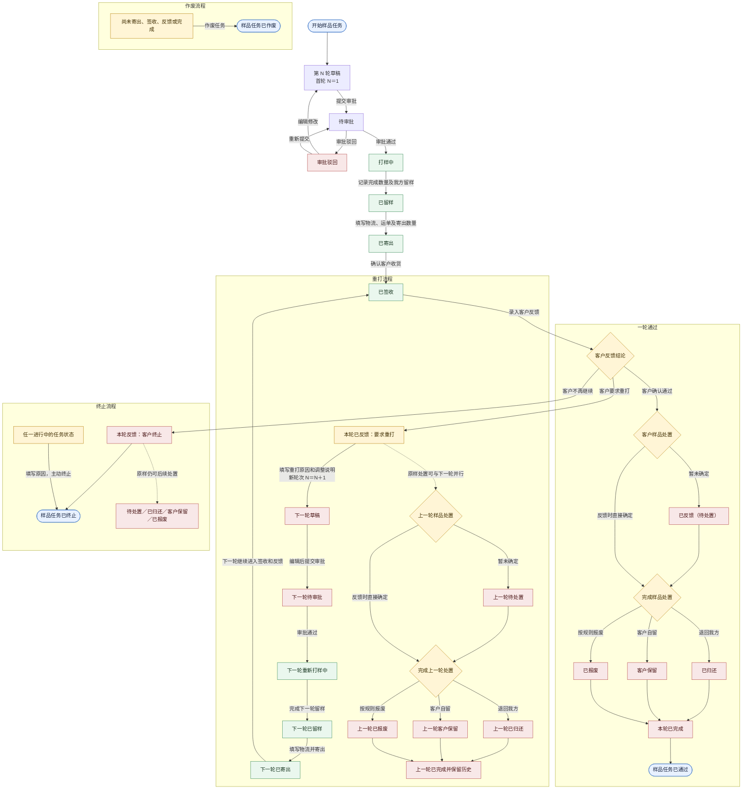

# OEM CRM 样品多轮打样与费用统计方案

## 1. 文档定位

- 目标：定义客户对样品不满意时的重打样、费用归集、反馈和归还处置规则。
- 状态：已实施（数据库结构、API、前端和本地数据适配已完成）。
- 适用范围：样品申请、内部审批、制样、寄送、客户反馈、重打样、费用和样品实物处置。
- 非目标：本方案不改变报价版本规则，不把样品反馈直接等同于客户阶段或订单状态。

## 2. 当前问题

当前 `SampleRequest` 同时承载审批、制样、物流、客户反馈、寄出前留样、客户样品归还和关闭状态；`SampleFee` 只关联 `sampleRequestId`。如果同一条样品记录从“已反馈”退回“打样中”，会出现以下问题：

1. R1、R2 的规格、物流、时间戳和反馈会被覆盖。
2. 多条费用虽然存在，但不能结构化判断属于哪一轮，只能依赖时间或备注推断。
3. 现有 `REJECTED` 表示内部审批驳回，不能复用为客户不满意。
4. “客户要求重打”和“样品是否归还”是两个独立事实，不能共用一个状态。

## 3. 推荐对象模型

### 3.1 `SampleRequest`：样品任务

一条客户样品需求只创建一个任务，作为所有轮次和费用的汇总 owner。

建议字段：

| 字段 | 说明 |
| --- | --- |
| `id` | 样品任务 ID |
| `customerId` | 客户归属 |
| `quoteId` | 可选的报价关联 |
| `currentRoundId` | 当前正在处理的轮次；由事务维护 |
| `closedAt` | 客户结论完成、终止或作废时间 |
| `terminationReason` | 终止原因，客户拒绝、客户放弃、内部停止等 |

### 3.2 `SampleRound`：实际打样轮次

每一次实际制样、寄样都对应一条轮次记录：R1、R2、R3。轮次保存规格快照，不能依赖任务当前规格回放历史。

建议字段：

| 字段 | 说明 |
| --- | --- |
| `id` | 轮次 ID |
| `sampleRequestId` | 所属样品任务 |
| `roundNo` | 轮次号，从 1 递增 |
| `previousRoundId` | 直接来源轮次，最多一个直接后继 |
| `status` | 本轮制样流程状态 |
| `resampleReason` | 重打原因，R2 及后续轮次必填 |
| `changeSummary` | 相比上一轮的调整内容 |
| `feedbackResult` | 客户反馈结论 |
| `feedback` | 客户原始反馈和补充说明 |
| `producedQuantity` | 本轮实际完成的样品总数量 |
| `shippedQuantity` | 本轮实际寄给客户的数量 |
| `retentionRecord` | 本轮唯一的寄出前留样记录 |
| `dispositionStatus` | 客户收到的样品后续处置状态 |

每轮寄出前必须先创建我方留样记录，并校验 `retainedQuantity + shippedQuantity <= producedQuantity`。轮次级规格、附件、物流时间、审批意见、留样记录和客户反馈均保留在本轮，不回写旧轮次。

### 3.3 `SampleFee`：费用明细

费用仍然按明细记录，但增加轮次归属：

| 字段 | 说明 |
| --- | --- |
| `sampleRequestId` | 必填，便于任务总额统计 |
| `sampleRoundId` | 可选；轮次成本填具体轮次，公共费用为空 |
| `feeType` | 打样、模具、快递、包装、退回等 |
| `amount` / `currency` | 原币金额；不同币种不得直接相加 |
| `costNature` | 公司承担，或客户承担 |
| `responsibility` | 工厂、客户、供应商、协商承担 |
| `paymentStatus` | 未收、已收、减免、退款等 |
| `incurredAt` | 费用实际发生时间 |

模具费等一次性公共费用只记录一次，不复制到后续轮次。

## 4. 状态和反馈合同

### 4.1 样品任务结果推导

`SampleRequest` 不再保存独立的总体状态字段。任务结果由当前或最近轮次、`terminationReason` 和 `closedAt` 推导：客户反馈 `ACCEPTED` 为已通过，`CUSTOMER_REJECTED` 或存在终止原因为已终止，作废轮次为已作废；没有终态结论时仍按当前轮次处理。

### 4.2 轮次制样状态

```text
DRAFT
  -> PENDING_APPROVAL
       -> APPROVAL_REJECTED -> DRAFT
       -> PREPARING
             -> RETAINED
                  -> SHIPPED
                       -> DELIVERED
                            -> FEEDBACK_RECEIVED
                                      -> COMPLETED
```

约束：

- `SHIPPED` 必须填写物流商、运单号和寄出时间。
- `RETAINED` 是寄出的前置门禁，必须记录留样数量、留样位置和留样时间；未完成留样不得进入 `SHIPPED`。
- 进入 `PREPARING` 后核心规格冻结；若要改变已开工规格，应作废当前轮次并新建下一轮。
- 审批驳回只表示内部审批结果，不表示客户不满意。
- 已寄出或已签收的真实业务记录不得改成 `VOIDED`。

### 4.3 客户反馈结论

轮次状态为 `DELIVERED` 时录入以下结论：

| `feedbackResult` | 处理结果 |
| --- | --- |
| `ACCEPTED` | 客户样品完成归还或客户保留处置后，当前轮关闭，样品任务变为 `PASSED` |
| `RESAMPLE_REQUIRED` | 只记录当前轮反馈和样品处置要求；操作员随后单独执行“生成重打草稿”，任务继续 `IN_PROGRESS` |
| `CUSTOMER_REJECTED` | 当前轮完成，任务变为 `TERMINATED` |

### 4.4 留样和客户样品处置

“留样”只表示**我方在每轮寄出前保留一份对照样**，不是客户反馈后的处置结果。`SampleRetentionRecord` 是留样事实的唯一 owner：

| 字段 | 说明 |
| --- | --- |
| `sampleRoundId` | 所属轮次 |
| `retainedQuantity` | 留存数量，至少 1 |
| `retainedAt` | 留样时间 |
| `retainedLocation` | 留样位置或样品编号 |
| `fileAssetIds` | 留样照片、检测记录或封样证据 |

客户收到的样品在反馈后的处置使用独立的 `dispositionStatus`：

```text
PENDING
RETURNED
CUSTOMER_KEPT
DISPOSED
```

其中：

- `CUSTOMER_KEPT`：无需退回、客户自留；界面显示“客户保留”，禁止再称为“已留样”。
- `RETURNED`：客户已将寄出的样品退回我方；界面继续显示现有文案“已归还”，不改名；如需入库或报废，另记退回后的去向。
- `DISPOSED`：客户样品或退回样品已按规则报废。

兼容约束：客户归还后的状态必须沿用现有 `RETURNED`，本轮新增的“寄出前我方留样”不能复用 `RETURNED` 或替换其含义。

客户要求重打且需要退回时，R1 的退回物流与 R2 的审批、重新打样可以并行：

```text
R1: FEEDBACK_RECEIVED + RESAMPLE_REQUIRED + PENDING
R2: DRAFT -> PENDING_APPROVAL -> PREPARING -> RETAINED -> SHIPPED

之后独立更新：
R1: RETURNED
```

无需退回时记录 `R1: CUSTOMER_KEPT`。无论原样是否需要退回，操作员都可在反馈保存后单独生成 R2 草稿，两条路径都不把客户保留称为留样。

### 4.5 状态流转总图



图中“已留样”只表示寄出前我方保留对照样；“客户保留”表示客户收到样品后的处置，两者不能混用。重打时原轮次的反馈、费用和样品处置记录保留不变，下一轮从草稿开始重新审批；原样退回与下一轮审批、打样可以并行。客户确认通过且样品完成归还、客户保留或报废处置后，样品任务进入“已通过”；客户终止或主动终止进入“已终止”，尚未寄出、签收、反馈或完成的任务才允许作废。

## 5. 重打样操作

“生成重打草稿”是独立业务命令，不是反馈保存的副作用，也不是把 R1 回退到 `PREPARING`：

1. 轮次处于 `DELIVERED` 时，先单独保存客户反馈结论和“需要退回 / 客户保留 / 已报废”等处置要求。
2. 仅当已保存的反馈结论为 `RESAMPLE_REQUIRED` 时，当前轮更多操作中显示“生成重打草稿”。
3. 操作员填写重打原因和调整说明后，创建 `roundNo + 1` 的新轮次；同一来源轮次不得重复生成。
4. 新轮次复制客户、报价、产品、规格、材质、工艺、数量、交期和附件；审批、物流、留样、费用、反馈和时间戳全部重置。
5. 新轮次固定从 `DRAFT` 开始。操作员打开草稿完成修改，再单独提交审批，不能直接跳过审批进入生产。
6. 旧样退回物流与新一轮草稿编辑、审批和打样可以并行推进。
7. `currentRoundId` 指向新草稿；任务结果继续由新轮次推导。

默认规则是每一轮重打都重新审批。本方案不提供跳过草稿编辑或审批的快速通道。

## 6. 费用统计

统计口径分为三层：

| 口径 | 计算方式 |
| --- | --- |
| 单轮成本 | 按 `sampleRoundId` 汇总实际成本 |
| 样品任务总成本 | 按 `sampleRequestId` 汇总所有轮次和公共费用 |
| 重打增量成本 | 汇总 R2 及后续轮次的实际成本 |

报表至少支持：

- 首轮打样成本
- 各轮重打成本
- 任务累计成本
- 客户收费、已收金额和企业承担金额
- 按重打原因、产品、客户和责任方统计重打率

多币种按币种分别汇总；若需要统一报表币种，必须保存汇率和汇率日期快照，不能用当前汇率覆盖历史成本。

## 7. 操作员界面投影

样品任务列表同时展示总体状态和当前轮次：

```text
样品任务：进行中
当前轮次：R2
当前动作：第 2 轮重新打样中
上一轮结论：客户要求重打
上一轮处置：客户保留
累计成本：USD 1,160
```

“重新打样中”是以下结构化条件的展示文案：

```text
currentRound.roundNo > 1
AND currentRound.status = PREPARING
```

“第 2 轮待审批”则对应 `roundNo = 2` 且 `status = PENDING_APPROVAL`。这样操作员可以区分尚未批准、正在生产、已寄出和已签收。

历史轮次保持 `COMPLETED` 作为流程状态，但客户反馈为 `CUSTOMER_REJECTED` 时，轮次链不展示泛化的“已关闭”，而是按 `dispositionStatus` 展示“待处置”“已归还”“客户保留”或“已报废”。样品任务结果仍展示“已终止”，不得用实物处置结果替代任务结论。

## 8. 验收标准

- 客户要求重打后，R1 的规格、费用、物流和反馈不可被 R2 覆盖。
- R2 在列表中显示为“第 2 轮待审批”或“第 2 轮重新打样中”。
- 每轮寄出前必须完成我方留样；客户收到的样品可以客户保留、待处置或 `RETURNED`（已归还）；处于待处置时，下一轮可以并行进入审批和重新打样。
- 可以查询每轮成本、任务累计成本和重打增量成本。
- 内部审批驳回与客户不满意使用不同字段和不同历史动作。
- 同一轮最多只能创建一个直接后继轮次。
- 每次重打、反馈、寄出前留样、归还和费用变更都有历史记录。

## 9. 实施结果和边界

本方案已按样品轮次作为唯一业务 owner 实施：

- Prisma 结构新增 `SampleRound`、`SampleRetentionRecord`、费用轮次归属和客户处置字段；服务器库为空的报价和样品记录可直接执行结构迁移。
- API 由 `SampleWorkflowService` 负责创建、编辑草稿、提交/审批、驳回、留样、寄出、签收、反馈、重打、客户处置、终止、作废和费用历史；旧单轮 `CommercialService` 样品 owner 已移除。
- 样品列表和 CSV 导出展示当前轮次、当前动作、上一轮反馈/处置、按币种的首轮成本、重打增量、累计实际成本、客户收费、已收金额、企业承担金额及每轮成本明细；任务结果由轮次和终止信息推导，不再单独持久化。
- 前端样品详情参照报价版本链，以紧凑轮次链切换当前查看轮次；规格、留样、物流和反馈只展示所选轮次，费用列表不再按轮次重复铺开。反馈保存和“生成重打草稿”是两个独立操作，状态动作与后端轮次命令一一对应。
- 本地已有费用数据已直接更新为 `ACTUAL_COST`、`FACTORY`、`NOT_APPLICABLE`，并直接补齐 `samples.*` 权限；这些历史数据更新没有写入迁移脚本。

统计约束保持不变：不同币种始终分开汇总；公共费用（例如模具费）只记录一次并归入公共费用；企业承担金额按实际成本减去已收客户收费计算。服务器部署不依赖本地数据更新 SQL，需按部署手册执行迁移和 seed/权限初始化。

验收入口：

```text
npm run lint -w @oem-crm/api
npm run lint -w @oem-crm/web
npm run build -w @oem-crm/api
npx vite build --outDir dist-sample-check-verify
npx ts-node -r tsconfig-paths/register src/modules/commercial/sample-cost-summary.spec.ts
npx ts-node -r tsconfig-paths/register src/modules/commercial/sample-workflow.integration.spec.ts
```
